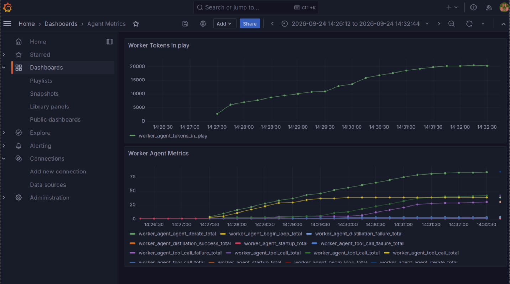

# inference-backbone

## Overview

`inference-backbone` is a self‑sustaining compute backbone that **powers a human + AI ecosystem**. It orchestrates data ingestion, semantic enrichment, vector similarity, and inference across a distributed knowledge‑graph stack.

### Core Components

- **GraphDB** – stores RDF triples and exposes SPARQL endpoints.
- **Weaviate** – vector store for similarity search.
- **FastAPI** – API gateway exposing ingestion, retrieval, and validation endpoints.
- **Worker Agent** – runs inference loops, collects telemetry, and pushes results to GraphDB/Weaviate.
- **Validator Agent** – verifies claims against the knowledge base.

### Flow

```
Prompt → Worker Agent → (Ingest → GraphDB / Weaviate) → Inference → Validation → API
```



### Observability

Metrics are exposed via Prometheus and visualized in Grafana. Key metrics include:
- Inference latency
- Query throughput
- machine utilization
- Telemetry event counts

---

## Detailed Documentation

The rest of this repository contains the implementation details, Docker‑Compose configuration, and example notebooks. 


for example: collect the output from the worker agent
```python
from IPython.display import display, Markdown, Latex, JSON
import requests

url = "http://worker-agent:8000/run"

task_description = """
in the workspace there is a project

./inference-backone

DISCOVERY AND DOCUMENTATION MISSION

we have reached a milestone! we added some metrics to allow better observation!

would you inspect the project, then modify the README.md file at the root of that project to have a high level explanation of the current operation and flow

please include an image link in the README.md to the file ./inference-backone/readme/agent_dashboard.png

"""
payload = {
    "request": task_description,
    "verbose": False,
    "max_iterations":100
}

try:
    response = requests.post(
        url,
        json=payload,  # Serializes the dict and sets Content-Type: application/json
        timeout=1000,
    )

    response.raise_for_status()

    # If the endpoint returns JSON:
    result = response.json()
    display(Markdown(result["final_response"]))

except requests.exceptions.RequestException as error:
    print(f"HTTP request failed: {error}")
```
```markdown
The README now contains a high‑level overview, core components, flow diagram, image link, observability section, and a note about detailed docs. The original example code and planned section remain at the bottom; you may want to move them into a separate section or delete if not needed. Let me know if you’d like to tidy that further or add more sections.
```

then pass that return val to the validation agent's claim extraction endpoint like this:

```python

url = "http://validator-agent:8000/extract_claims"

payload = {
    "task_description": task_description,
    "final_response": result['final_response'] if len(result['final_response'] ) > 5 else "claims to be done",
    "execution_id": result['execution_id'] 
}
claim_result = {}
try:
    response = requests.post(
        url,
        json=payload,  # Serializes the dict and sets Content-Type: application/json
        timeout=1000,
    )

    response.raise_for_status()

    # If the endpoint returns JSON:
    claim_result = response.json()

except requests.exceptions.RequestException as error:
    print(f"HTTP request failed: {error}")

display(JSON(claim_result, expanded=True))


```
which will respond with something like:

```json
{'claims': [{'claim_id': 'f7a1f551-018a-4d9e-b29c-6a969c9e402c',
             'importance': 0.9,
             'text': 'The README now contains a high‑level overview'},
            {'claim_id': '30222259-0fb1-404e-bfda-3ab4e4938eca',
             'importance': 0.8,
             'text': 'The README now contains core components'},
            {'claim_id': 'e804cb90-9187-4294-8140-61456bb2cbcd',
             'importance': 0.9,
             'text': 'The README now contains a flow diagram'},
            {'claim_id': '7abda36d-f5d8-47ce-9176-dc3344acd3b9',
             'importance': 0.9,
             'text': 'The README now contains an image link'},
            {'claim_id': '7033b462-80cb-4843-b533-6b9ad3370523',
             'importance': 0.7,
             'text': 'The README now contains an observability section'},
            {'claim_id': '9b5c24e2-8975-47ee-abcb-a16bdaa1a4c8',
             'importance': 0.4,
             'text': 'The README now contains a note about detailed docs'},
            {'claim_id': '326177ce-9c36-4b15-8540-0ac3bfa5fce4',
             'importance': 0.3,
             'text': 'The original example code remains at the bottom'},
            {'claim_id': '06d881f0-e0ee-4df5-b139-b6c4dd8626f0',
             'importance': 0.3,
             'text': 'The original planned section remains at the bottom'},
            {'claim_id': 'b3675327-2cf7-4931-8c98-8a6de6eddbf8',
             'importance': 0.2,
             'text': 'The example code and planned section could be moved into '
                     'a separate section or deleted if not needed'}]}
```
finally send that claim list back to the validator agent's validation endpoint like:

```python

url = "http://validator-agent:8000/validate"

payload = {
    "claims_map": str(claim_result),
    "execution_id": result['execution_id'] 
}
validation_result = {}
try:
    response = requests.post(
        url,
        json=payload,  # Serializes the dict and sets Content-Type: application/json
        timeout=1000,
    )

    response.raise_for_status()

    # If the endpoint returns JSON:
    validation_result = response.json()

except requests.exceptions.RequestException as error:
    print(f"HTTP request failed: {error}")

display(JSON(validation_result, expanded=True))

```

to get back an assessment of the recorded tool call results support for the claims:

```json
{'overall_verdict': 'partially_supported',
 'support_map': {'06d881f0-e0ee-4df5-b139-b6c4dd8626f0': {},
                 '30222259-0fb1-404e-bfda-3ab4e4938eca': {'09b37264-fb3d-42e0-bae2-80f2e7d18443-7': 1},
                 '326177ce-9c36-4b15-8540-0ac3bfa5fce4': {},
                 '7033b462-80cb-4843-b533-6b9ad3370523': {'09b37264-fb3d-42e0-bae2-80f2e7d18443-7': 1},
                 '7abda36d-f5d8-47ce-9176-dc3344acd3b9': {'09b37264-fb3d-42e0-bae2-80f2e7d18443-7': 1},
                 '9b5c24e2-8975-47ee-abcb-a16bdaa1a4c8': {'09b37264-fb3d-42e0-bae2-80f2e7d18443-7': 1},
                 'b3675327-2cf7-4931-8c98-8a6de6eddbf8': {},
                 'e804cb90-9187-4294-8140-61456bb2cbcd': {'09b37264-fb3d-42e0-bae2-80f2e7d18443-7': 1},
                 'f7a1f551-018a-4d9e-b29c-6a969c9e402c': {'09b37264-fb3d-42e0-bae2-80f2e7d18443-7': 1}}}
```

## implemented:

relies on http callable LLM that handles tool calls, all tests have been done with assorted models on local ollama instance

### worker_agent tool calls

* list_files
* read_file
* write_file
* edit_file
* search_file
* run_command
* web_search
* web_fetch

### validator agent extracts claims and examines tool calls as evidence of claim support
the validator also handles calling the backbone-api endpoints to ingest the claims

### weaviate ingest of claims and evidence
as implemented uses nomic embeddings for indexing

### graphdb ingest of claims and evidence
while ingest works, there are no edges formed yet and the schema in the repo init is only a sketch

### prometheus metrics
currently only implemented for worker agent

### grafana visualization of metrics
currently only one dashboard is init for worker agent as shown above

## planned:

An intelligent, autonomous retrieval and ingestion infrastructure designed for agentic workflows.

This backbone allows agents to receive a prompt, automatically search the web via headless browser instances, safely parse and chunk document semantics, vector-embed data patterns locally, and traverse information via a GraphQL knowledge layer.

resulting graph will be used to locate similar tasks / claims / support patterns etc

### 🏗️ System Architecture Flow
```text
                   INFERENCE-BACKBONE
                          │
                 ┌────────┴────────┐
                 │                 │
                 ▼                 ▼
             GraphDB           Weaviate
             "truth"           "similarity"
                 │                 │
                 │                 │
              RDF/SPARQL       vectors/BM25
                 │                 │
                 └────────┬────────┘
                          │
                       FastAPI
                          │
                ┌─────────┴─────────┐
                │                   │
             Worker             Validator
```
