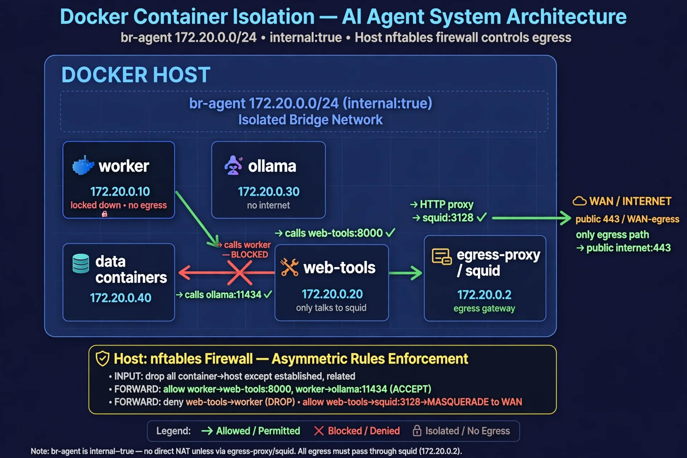

# on host machine

```bash
#!/usr/sbin/nft -f

# Include this from /etc/nftables/main.nft with:
# include "/etc/nftables/agent-isolated.nft"

table inet agent_iso {
  chain forward {
    type filter hook forward priority 0; policy drop;

    # Allow established
    ct state established,related accept

    # --- ASYMMETRICAL RULES ---
    # Worker -> Web-tools:8000 ALLOWED (worker can call fetch)
    ip saddr 172.20.0.10 ip daddr 172.20.0.20 tcp dport 8000 accept

    # Web-tools -> Worker: BLOCKED (web-tools cannot call worker)
    ip saddr 172.20.0.20 ip daddr 172.20.0.10 drop

    # Worker -> Ollama:11434 ALLOWED (only ollama)
    ip saddr 172.20.0.10 ip daddr 172.20.0.30 tcp dport 11434 accept

    # Worker -> Data containers / backbone: DENIED (isolated from data)
    ip saddr 172.20.0.10 ip daddr 172.20.0.40/29 drop
    ip saddr 172.20.0.20 ip daddr 172.20.0.40/29 drop

    # Web-tools -> Data / Backbone: DENIED (isolated from backbone api)
    ip saddr 172.20.0.20 ip daddr 172.20.0.40/29 drop

    # Worker -> Egress-proxy:3128 ALLOWED only if you need backbone api via squid
    # Remove this line if worker now has NO wan-egress at all (pure isolated)
    ip saddr 172.20.0.10 ip daddr 172.20.0.2 tcp dport 3128 accept

    # Web-tools -> Egress-proxy:3128 ALLOWED (its only way out)
    ip saddr 172.20.0.20 ip daddr 172.20.0.2 tcp dport 3128 accept

    # Web-tools cannot talk to local/wireless networks even via FORWARD
    ip daddr 10.0.0.0/8 drop
    ip daddr 172.16.0.0/12 drop
    ip daddr 192.168.0.0/16 drop
    ip daddr 169.254.0.0/16 drop
    ip daddr 127.0.0.0/8 drop

    # Allow inter-bridge DNS from docker (127.0.0.11 is docker's internal DNS)
    # This is handled in OUTPUT chain inside containers, not here
  }

  chain input {
    type filter hook input priority 0; policy accept;
    # nothing to do, host input not affected
  }
}

```

# network asymmetry

```bash
# 1. Make sure your agent-isolated network uses that bridge name
# In compose:
# networks:
#   agent-isolated:
#     name: agent-isolated
#     driver: bridge
#     driver_opts:
#       com.docker.network.bridge.name: br-agent
#       com.docker.network.bridge.enable_icc: "false"
#     internal: true
#     ipam: { config: [{ subnet: 172.20.0.0/24 }] }

# 2. Include the file
echo 'include "/etc/nftables/agent-isolated.nft"' | sudo tee -a /etc/nftables/main.nft

# 3. Test without reboot
sudo nft -c -f /etc/nftables/main.nft && sudo systemctl reload nftables

# 4. Verify asymmetry
docker exec worker curl -v http://172.20.0.20:8000/fetch  # should work
docker exec web-tools curl -v http://172.20.0.10:8000     # should hang/drop

docker exec worker getent hosts ollama   # 172.20.0.30 ok
docker exec worker ping 172.20.0.40      # data container -> dropped
```

# inside container config
```yaml
services:
  worker:
    cap_add: [NET_ADMIN] # only to set iptables on start
    entrypoint: ["/app/secure-entrypoint.sh"]
```
## secure-entrypoint.sh:

```bash
#!/bin/sh
iptables -P OUTPUT DROP
iptables -A OUTPUT -o lo -j ACCEPT
iptables -A OUTPUT -d 127.0.0.11 -p udp --dport 53 -j ACCEPT
iptables -A OUTPUT -d 172.20.0.20 -p tcp --dport 8000 -j ACCEPT
iptables -A OUTPUT -d 172.20.0.30 -p tcp --dport 11434 -j ACCEPT
iptables -A OUTPUT -d 172.20.0.2 -p tcp --dport 3128 -j ACCEPT
# drop caps after setting rules
exec capsh --drop=cap_net_admin -- -c "python main.py"
```
That gives you both layers: nft on host enforces asymmetry even if container iptables are wiped, and container iptables enforces only-ollama even if nft is flushed.


# web-tools hardening idea:
```bash
#!/bin/sh
set -e

# This container has NO cap_add after boot, but needs NET_ADMIN for 2 seconds to lock itself down
# Run as root initially, then drop to appuser

# 1. Default deny all outbound
iptables -P OUTPUT DROP
iptables -P INPUT DROP
iptables -P FORWARD DROP

# 2. Always allow loopback
iptables -A INPUT -i lo -j ACCEPT
iptables -A OUTPUT -o lo -j ACCEPT

# 3. Allow Docker DNS only
iptables -A OUTPUT -d 127.0.0.11 -p udp --dport 53 -j ACCEPT
iptables -A OUTPUT -d 127.0.0.11 -p tcp --dport 53 -j ACCEPT

# 4. BLOCK local + wireless + metadata - even before allow rules (defense in depth)
# This is what stops SSRF to 192.168.1.1, your router, host, etc.
iptables -A OUTPUT -d 10.0.0.0/8 -j DROP
iptables -A OUTPUT -d 172.16.0.0/12 -j DROP
iptables -A OUTPUT -d 192.168.0.0/16 -j DROP
iptables -A OUTPUT -d 169.254.0.0/16 -j DROP
iptables -A OUTPUT -d 127.0.0.0/8! -o lo -j DROP
iptables -A OUTPUT -d 100.64.0.0/10 -j DROP
# AWS/GCP metadata
iptables -A OUTPUT -d 169.254.169.254 -j DROP

# 5. Allow ONLY egress-proxy squid (172.20.0.2:3128) - its only way to internet
iptables -A OUTPUT -d 172.20.0.2 -p tcp --dport 3128 -m conntrack --ctstate NEW,ESTABLISHED -j ACCEPT
iptables -A INPUT -s 172.20.0.2 -p tcp --sport 3128 -m conntrack --ctstate ESTABLISHED -j ACCEPT

# 6. Allow worker to call us (INPUT for the fetch API)
# If your web-tools API listens on 8000
iptables -A INPUT -s 172.20.0.10 -p tcp --dport 8000 -m conntrack --ctstate NEW,ESTABLISHED -j ACCEPT
iptables -A OUTPUT -d 172.20.0.10 -p tcp --sport 8000 -m conntrack --ctstate ESTABLISHED -j ACCEPT

# 7. Explicitly DROP any attempt to call worker (asymmetry enforcement inside container too)
iptables -A OUTPUT -d 172.20.0.10 -j DROP

# 8. Drop everything else
# Already default DROP

echo "[web-tools] firewall locked:"
iptables -L OUTPUT -v -n --line-numbers

# Now drop privileges and exec app as non-priv user
# Your Dockerfile should have: RUN adduser --disabled-password --gecos '' appuser
exec su appuser -c "python -m web_fetch_service"
```

## and in the web-tools docker

```Dockerfile
FROM mcr.microsoft.com/playwright:v1.52.0-noble

RUN apt-get update && apt-get install -y iptables iproute2 && rm -rf /var/lib/apt/lists/*

WORKDIR /app
COPY requirements.txt.
RUN pip install -r requirements.txt

COPY secure-entrypoint.sh /app/
RUN chmod +x /app/secure-entrypoint.sh

# Create unpriv user
RUN useradd -m -u 10001 appuser && chown -R appuser /app

USER root
ENTRYPOINT ["/app/secure-entrypoint.sh"]
```

## and in the web-tools app
```python
import socket, ipaddress
from urllib.parse import urlparse

PRIVATE_NETS = [ipaddress.ip_network(n) for n in [
    "10.0.0.0/8", "172.16.0.0/12", "192.168.0.0/16",
    "127.0.0.0/8", "169.254.0.0/16", "100.64.0.0/10", "::1/128", "fe80::/10", "fc00::/7"
]]

def assert_public(url: str):
    parsed = urlparse(url)
    host = parsed.hostname
    if not host:
        raise ValueError("no host")
    if host in ("localhost", "metadata", "metadata.google.internal") or host.endswith(".local") or host.endswith(".internal"):
        raise ValueError(f"blocked local host: {host}")
    try:
        # resolve and check ALL A records
        for info in socket.getaddrinfo(host, None):
            ip = ipaddress.ip_address(info[4][0])
            if any(ip in net for net in PRIVATE_NETS):
                raise ValueError(f"blocked private IP {ip} for {host}")
            if ip.is_private or ip.is_loopback or ip.is_link_local or ip.is_reserved:
                raise ValueError(f"blocked non-public IP {ip}")
    except socket.gaierror:
        raise ValueError(f"cannot resolve {host}")

# use it before every fetch
assert_public(user_url)
```

Now you have 3 layers for web-tools:

    Host nft - web-tools cannot even reach 192.168.x or worker via FORWARD
    Container iptables - even if host nft flushed, container itself drops private
    App layer - even if iptables somehow bypassed, python blocks before fetch

And worker still has its own secure-entrypoint.sh with only ollama:11434 + web-tools:8000 + squid:3128 allowed, and cannot be called by web-tools.


